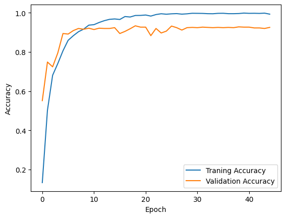
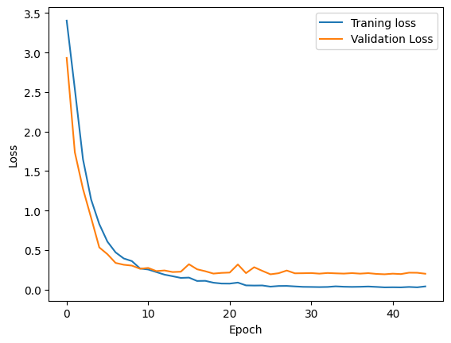
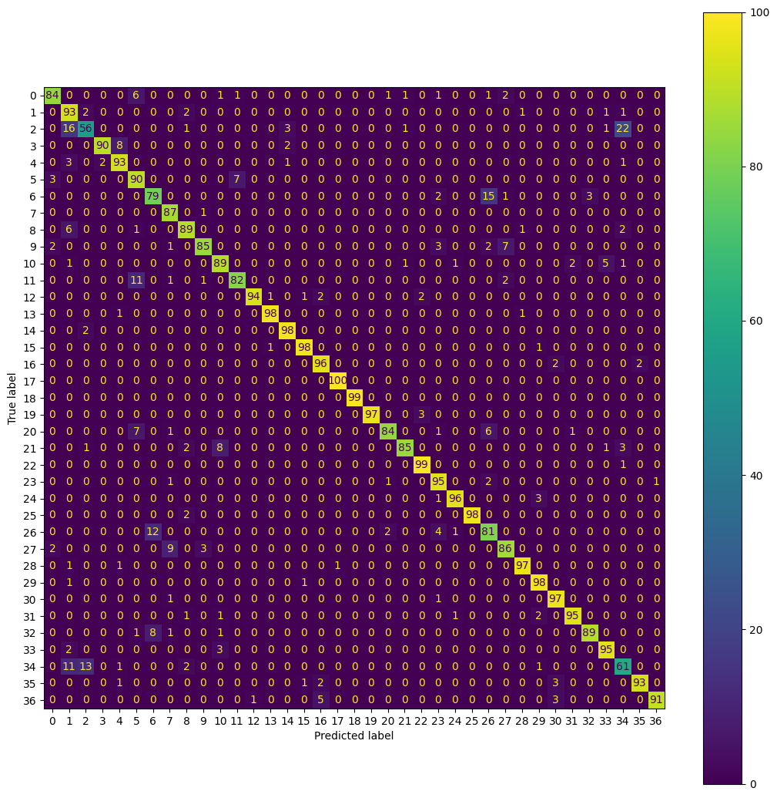
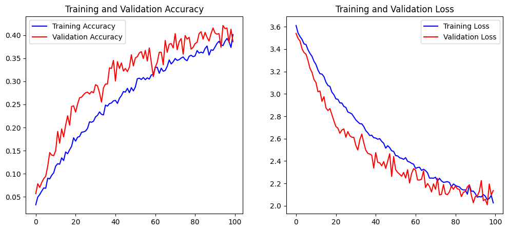
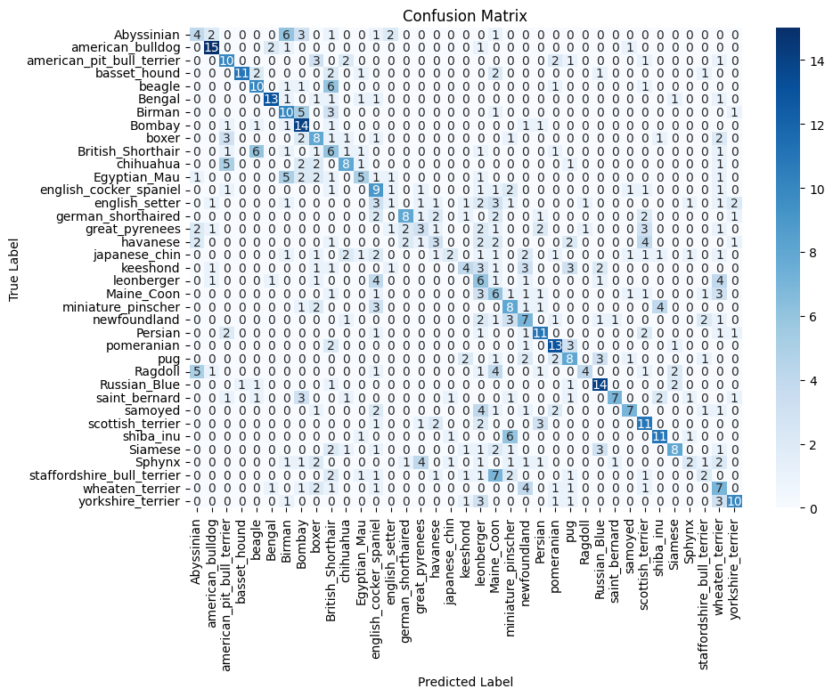

# Pet Breed Classification and Segmentation

This project implements both classification and semantic segmentation models for the Oxford-IIIT Pet Dataset, providing tools for breed identification and pet outline segmentation.

## Features

- Multi-class classification of 37 pet breeds
- Semantic segmentation for pet outlines
- Comprehensive evaluation metrics
- Detailed visualizations

## Installation

```bash
git clone https://github.com/engyyezzatt/Oxford_IIIT_Pet_classification_Seg.git
cd Oxford_IIIT_Pet_classification_Seg
pip install -r requirements.txt
```

## Project Structure

```
project/
├── src/            # Source code
├── tests/          # Unit tests
├── notebooks/      # Jupyter notebooks
├── docs/           # Documentation
└── data/           # Dataset directory
└── models/           # Saved models directory
```

## Evaluation Metrics

### Classification
- Accuracy
- Loss
- Confusion Matrix

### Segmentation
- Intersection over Union (IoU)
- Dice Coefficient
- Pixel Accuracy

# Results

## Classification evaluation plots 

### Fine-Tuned-ResNet34

1. Train-Val Accuracy Plot 



2. Train-Val Loss Plot 



3. Confusion Matrix 



### Simple CNN Model 
1. Train-Val Accuracy&Loss Plot 



2. Confusion Matrix 



## Segmentation evaluation plots: 

1. IOU & Dice Coefficient & Pixel Accuracy


## Contributing

1. Fork the repository
2. Create your feature branch
3. Commit your changes
4. Push to the branch
5. Create a Pull Request
